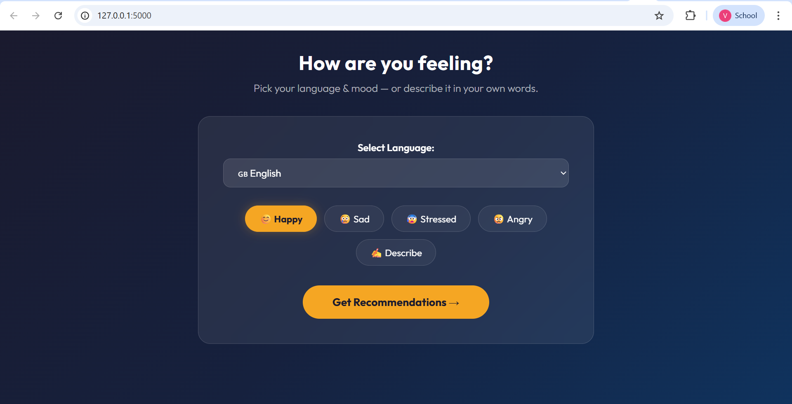
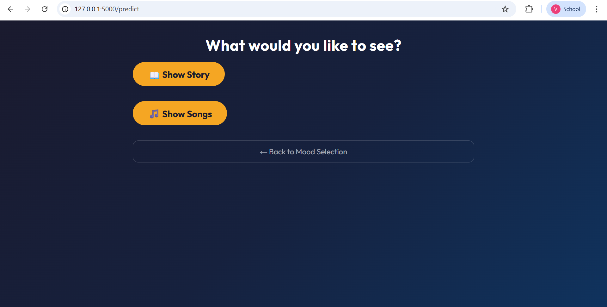
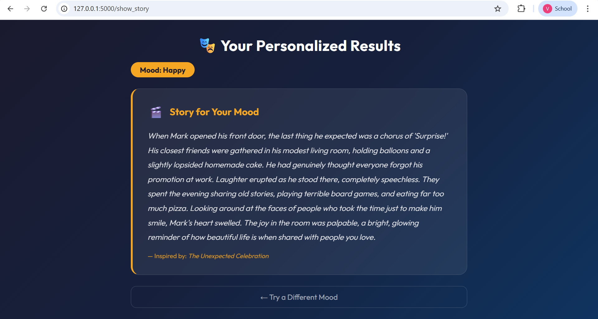
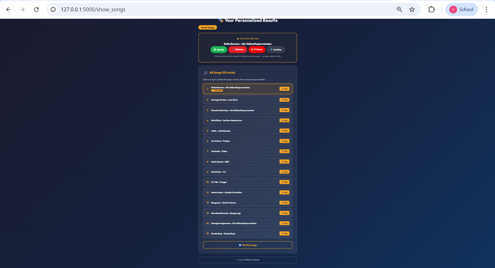

# Smart Mood-Based Story and Music Recommender 🎧📖

An AI-powered web application that detects the user's mood from text input using Natural Language Processing (NLP) and recommends a motivational story and music to improve emotional well-being.

---

## 🚀 Features

* **Mood Detection** using Machine Learning (TF-IDF + Naive Bayes)
* **Song Recommendation** (English, Telugu, Hindi)
* **Story Recommendation** (Full stories for each mood)
* **Spotify Integration** for live, dynamic music searching
* **YouTube & JioSaavn Integration** for flexible playback
* **Modern Premium UI** with glassmorphism-inspired responsive design
* **Smart Shuffle** to explore different recommendations instantly
* Supports multiple moods such as:

  * Happy
  * Sad
  * Stress
  * Angry

---

## 🛠️ Technologies Used

* **Python**
* **Flask**
* **Machine Learning** (Scikit-learn)
* **Natural Language Processing** (TF-IDF)
* **Pandas** (Data Analysis)
* **Spotify Web API** (Spotipy)
* **Python-dotenv** (Environment Management)
* **HTML5 / CSS3 / JavaScript**

---

## 📂 Project Structure

```
Smart-Mood-Recommender/
│
├── app.py                  # Flask backend
├── train_model.py          # Model training script
├── mood_model.pkl          # Saved Naive Bayes model
├── tfidf_vectorizer.pkl    # Saved TF-IDF vectorizer
├── README.md               # Project documentation
│
├── dataset/
│   ├── moods.csv           # Training dataset
│   ├── stories.csv         # Stories database
│   └── songs.csv           # Songs database
│
├── static/
│   └── style.css           # UI styling
│
├── templates/
│   ├── index.html          # Home page
│   └── result.html         # Recommendation page
│
└── screenshots/
    ├── home-1.png
    ├── home-2.png
    ├── result-1.png
    └── result-2.png
```

---

## ⚙️ Setup Instructions

### 1️⃣ Clone the Repository

```
git clone https://github.com/sudhakar062004/smart-mood-recommender.git
```

### 2️⃣ Install Dependencies

```
pip install flask pandas scikit-learn joblib spotipy python-dotenv
```

### 3️⃣ Configure Spotify API (Optional but Recommended)

1. Create a `.env` file in the root directory.
2. Add your Spotify credentials:
   ```
   SPOTIPY_CLIENT_ID=your_id_here
   SPOTIPY_CLIENT_SECRET=your_secret_here
   ```

### 3️⃣ Train the Model (Optional)

The model is already trained, but you can retrain it using:

```
python train_model.py
```

### 4️⃣ Run the Application

```
python app.py
```

### 5️⃣ Open the Web App

Open your browser and visit:

```
http://127.0.0.1:5000
```

---

## 📸 Screenshots

### Home Page





### Recommendation Results





---

## 💡 Future Improvements

* **Deep Learning** for more nuanced emotion detection
* **User Authentication** to save favorite recommendations
* **Daily Mood Tracking** with visual charts
* **Browser Extension** for quick mood-based music while browsing

---

## 👨‍💻 Author

**Sudhakar Reddy**

AI / Machine Learning Enthusiast
Passionate about building intelligent applications that improve user experience.

---

## ⭐ If you like this project

Give this repository a **star on GitHub** to support the project!
